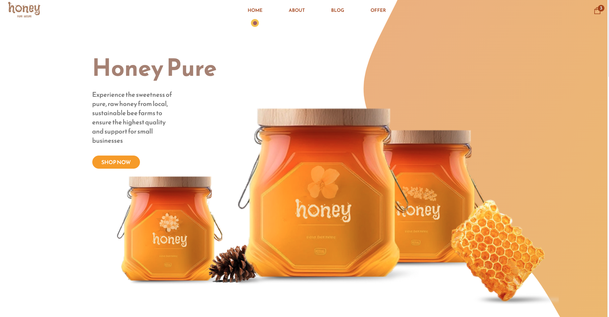
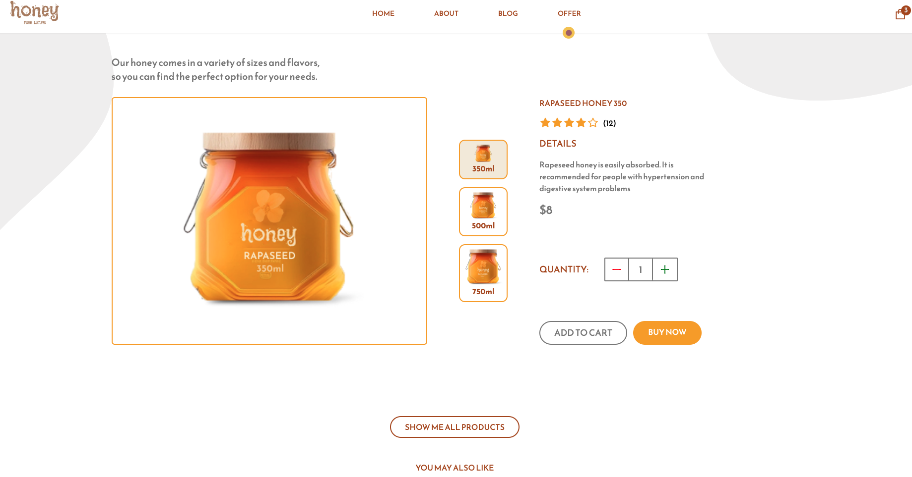
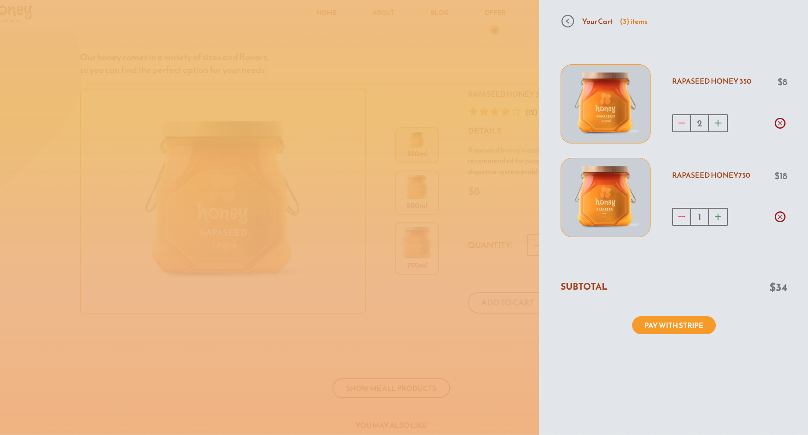

# MIODEK_V4


**Miodek4** Full Stack E-commerce React Application with Stripe. Modern design and fully functional. Build in Next.js and Sanity with complete Stripe integration

[https://miodek4.vercel.app/](https://miodek4.vercel.app/)



### Features
- Advanced React Practices such as folder and file structure, hooks, and refs or Higher-Order Components used for different SVG layouts,
- All advanced cart and checkout functionalities,
- Complete integration with Stripe to manage payments,
-  React Context API for state management, 
-  File-based routing, server-side rendering - best practices with Next.js,
- styled with Tailwind,
- I used ChatGPT to create content in sections and Midjourney to create a jars design look




### Under the hood

Technologies being used under the hood:

#### Stack:

- React
- Next
- Sanity
- Stripe
- Tailwind




#### Project setup


First, run the development server:

```bash
npm run dev
# or
yarn dev
```

Open [http://localhost:3000](http://localhost:3000) with your browser to see the result.


### Live view

just visit [https://miodek4.vercel.app/](https://miodek4.vercel.app/)!

Made with [@gregsypek](https://twitter.com/@gregsypek) 2022
